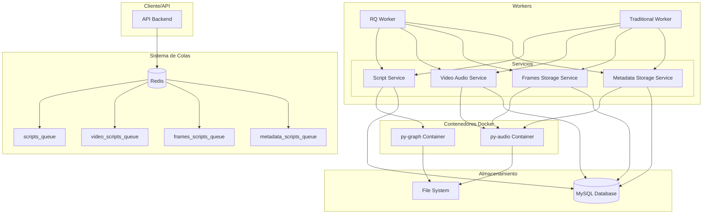
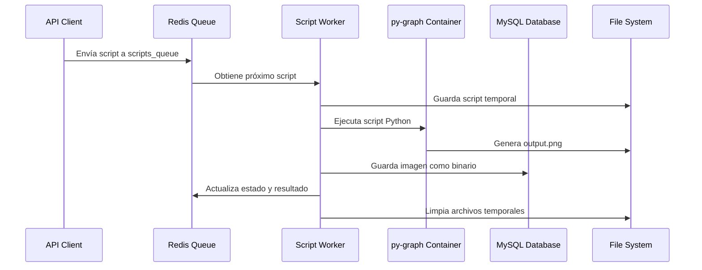
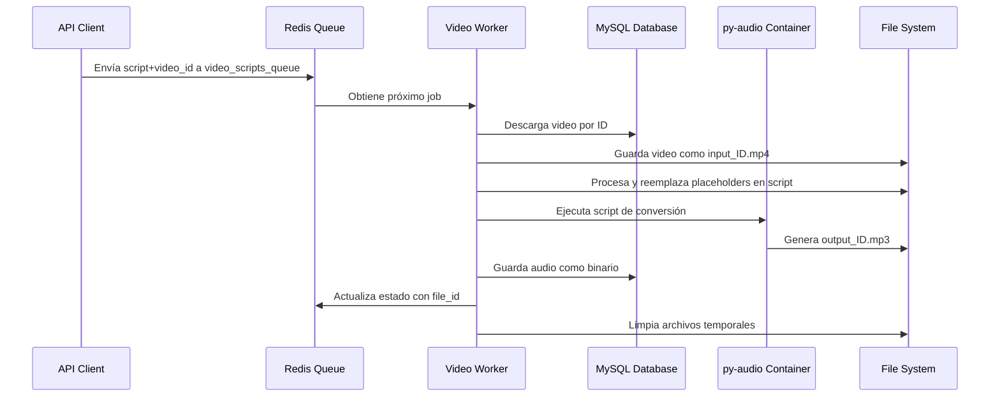
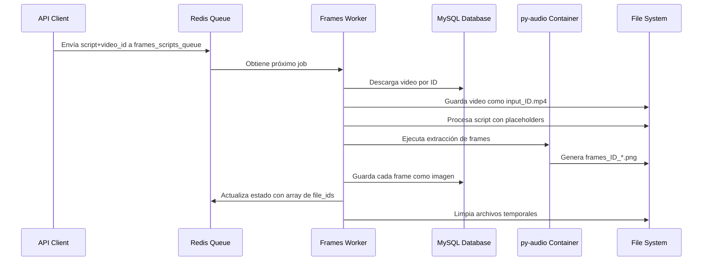
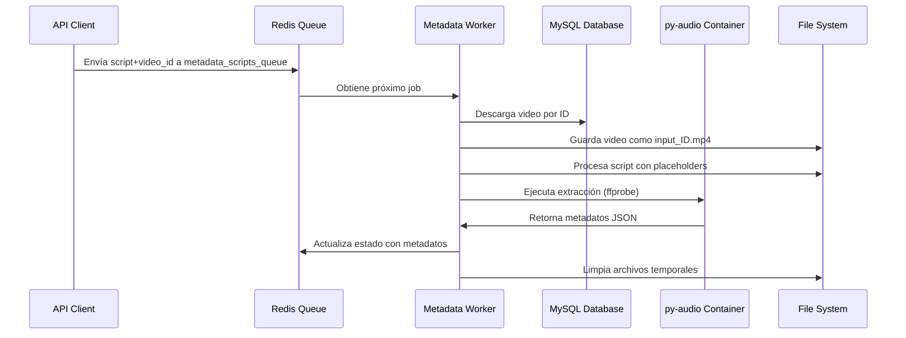
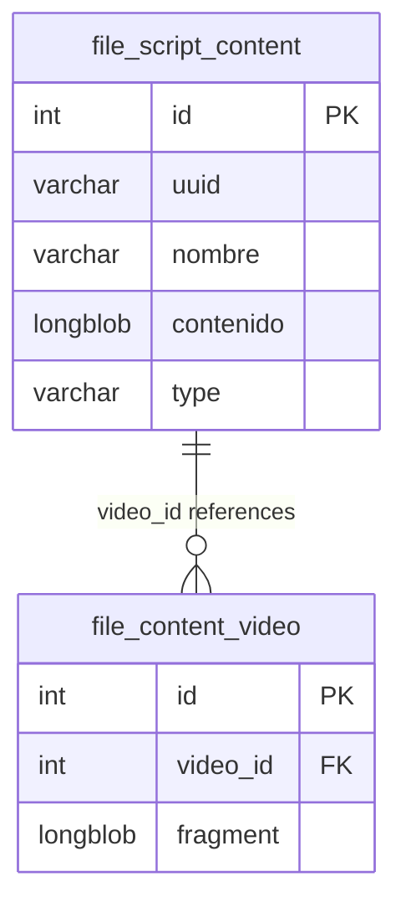
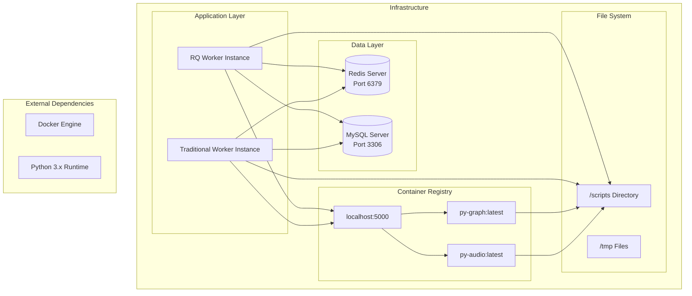

# Grec0AI Backend Worker

Sistema de workers backend para el procesamiento de videos, extracción de frames, conversión de audio y extracción de metadatos de la plataforma Grec0AI. El sistema utiliza contenedores Docker para el procesamiento, Redis para la gestión de colas y MySQL para el almacenamiento persistente.

## Tabla de Contenidos

- [Arquitectura General](#arquitectura-general)
- [Componentes del Sistema](#componentes-del-sistema)
- [Flujos de Procesamiento](#flujos-de-procesamiento)
- [Esquema de Base de Datos](#esquema-de-base-de-datos)
- [Arquitectura de Despliegue](#arquitectura-de-despliegue)
- [Configuración](#configuración)
- [Instalación y Uso](#instalación-y-uso)
- [Especificaciones Técnicas](#especificaciones-técnicas)

## Arquitectura General



## Componentes del Sistema

### Workers Principales

1. **Script Worker**: Genera imágenes ejecutando scripts Python en contenedor `py-graph`
2. **Video Worker**: Convierte videos a audio usando contenedor `py-audio`
3. **Frames Worker**: Extrae frames de videos usando contenedor `py-audio`
4. **Metadata Worker**: Extrae metadatos de videos usando contenedor `py-audio`

### Modos de Ejecución

- **Modo Tradicional** (`main.py`): Workers con hilos y polling manual de Redis
- **Modo RQ** (`rq_worker.py`): Workers basados en Redis Queue para gestión robusta

## Flujos de Procesamiento

### Flujo de Procesamiento de Scripts



### Flujo de Conversión Video a Audio



### Flujo de Extracción de Frames



### Flujo de Extracción de Metadatos



## Esquema de Base de Datos



### Tablas Principales

- **file_script_content**: Almacena archivos generados (imágenes, audio) con contenido binario
- **file_content_video**: Almacena fragmentos de videos para optimizar el almacenamiento

## Arquitectura de Despliegue



## Configuración

### Variables de Entorno

Crear archivo `.env` con las siguientes variables:

```env
# MySQL Configuration
MYSQL_HOST=localhost
MYSQL_PORT=3306
MYSQL_USER=usuario
MYSQL_PASSWORD=contraseña
MYSQL_DB=grec0ai_db

# Redis Configuration (opcional, por defecto localhost:6379)
REDIS_HOST=127.0.0.1
REDIS_PORT=6379
REDIS_DB=0
```

### Contenedores Docker Requeridos

```bash
# Contenedor para procesamiento de gráficos/imágenes
docker pull localhost:5000/py-graph

# Contenedor para procesamiento de audio/video (incluye FFmpeg)
docker pull localhost:5000/py-audio
```

## Instalación y Uso

### Requisitos Previos

- Python 3.x
- Docker Engine
- Redis Server
- MySQL Server
- Contenedores Docker: `localhost:5000/py-graph` y `localhost:5000/py-audio`

### Instalación

1. Clona el repositorio:
```bash
git clone <repository-url>
cd Grec0AI_backend_py_worker
```

2. Instala las dependencias:
```bash
pip install -r requirements.txt
```

3. Configura las variables de entorno:
```bash
cp .env.example .env
# Edita .env con tus configuraciones
```

### Uso

#### Modo RQ (Recomendado)

1. Inicia el worker de RQ:
```bash
python rq_worker.py
```

2. Añade trabajos a las colas usando el RedisService:
```python
from app.services.redis_service import RedisService

redis_service = RedisService()

# Trabajo de script
redis_service.enqueue_script("script_123", "print('Hello World')")

# Trabajo de conversión de video
redis_service.enqueue_video_conversion("script_456", "script_content", "video_789")

# Trabajo de extracción de frames
redis_service.enqueue_frames_extraction("script_789", "script_content", "video_123")

# Trabajo de extracción de metadatos
redis_service.enqueue_metadata_extraction("script_101", "script_content", "video_456")

# Despliegue de un frontend desde código HTML
html_code = "<h1>Hola</h1>"
redis_service.enqueue_frontend_deployment("deploy_001", html_code)
# Obtener la URL generada
url = redis_service.r.blpop("results_queue_deploy_001")[1].decode("utf-8")
print(url)
```

#### Modo Tradicional

```bash
python main.py
```

### Nombres de Colas Redis

- `scripts_queue`: Scripts para generación de imágenes
- `video_scripts_queue`: Scripts para conversión video-audio
- `frames_scripts_queue`: Scripts para extracción de frames
- `metadata_scripts_queue`: Scripts para extracción de metadatos
- `frontend_queue`: Despliegue de frontends estáticos

## Especificaciones Técnicas

### Dependencias

```
fastapi==0.104.1
uvicorn==0.24.0
mysql-connector-python==8.2.0
redis==5.0.1
python-dotenv==1.0.0
rq==1.15.1
```

### Formato de Datos

#### Scripts Queue
```
"script_id:script_content"
```

#### Video/Frames/Metadata Queues
```
"script_id:script_content:video_id"
```

#### Estados de Procesamiento
- `in_progress`: Trabajo en curso
- `completed`: Trabajo completado exitosamente
- `failed`: Trabajo falló con error

### Placeholders en Scripts

Los scripts pueden contener placeholders que se reemplazan dinámicamente:

- `{{input_name}}`: Nombre del archivo de entrada (sin extensión)

### Estructura de Directorios

```
Grec0AI_backend_py_worker/
├── app/
│   ├── services/           # Servicios de procesamiento
│   └── utils/             # Utilidades (conexión DB)
├── scripts/               # Directorio de trabajo para scripts
├── main.py               # Worker tradicional
├── rq_worker.py          # Worker RQ
└── requirements.txt      # Dependencias
```

### Monitoreo y Logs

Los workers imprimen logs detallados del procesamiento:

```
Iniciando worker de scripts para generar imagenes...
Procesando script script_123 con contenido: print('test')
Script guardado en /path/to/script
Script ejecutado con éxito: output
```

### Gestión de Errores

- Errores de ejecución se capturan y reportan via Redis
- Archivos temporales se limpian automáticamente
- Estados de error se almacenan para debugging
